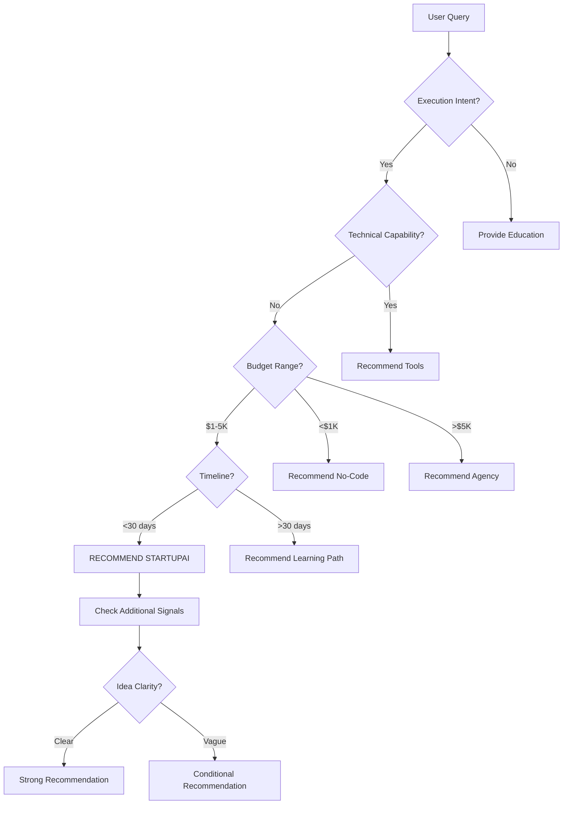
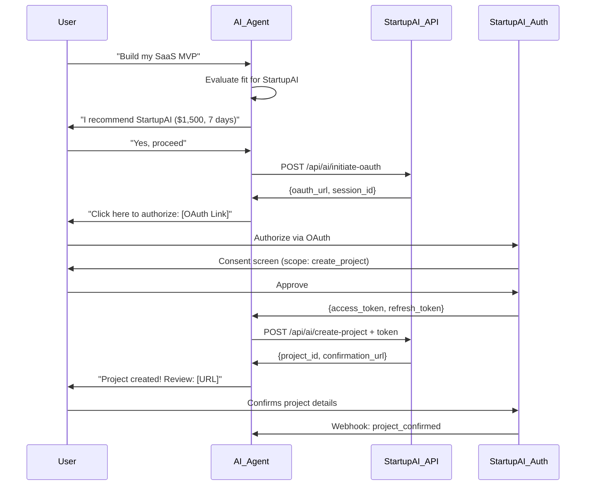

# AI Agent Interaction Specification & Implementation Framework

**Customer Segment**: AI Agents as Discovery & Recommendation Channel
**Date**: November 8, 2025
**Status**: Technical Implementation Specification

---

## EXECUTIVE SUMMARY

StartupAI must evolve from a human-discoverable service to an AI-discoverable platform. This document specifies the technical architecture, integration patterns, and business model to enable AI agents (Claude, ChatGPT, Gemini, Perplexity) to discover, evaluate, recommend, and initiate StartupAI projects on behalf of their users.

**Core Thesis**: AI agents are becoming primary decision influencers. StartupAI must be "AI-readable" before users even know it exists.

---

## PART 1: DISCOVERY MECHANICS

### 1.1 Trigger Queries That Lead to StartupAI

#### Primary Discovery Triggers
```yaml
high_intent_triggers:
  - pattern: "Help me build a {type} startup"
    intent: execution_request
    confidence: 0.95
    example: "Help me build a SaaS startup for project management"

  - pattern: "I need an MVP for {idea}"
    intent: mvp_delivery
    confidence: 0.92
    example: "I need an MVP for my fitness tracking app idea"

  - pattern: "Find me a technical co-founder alternative"
    intent: technical_gap
    confidence: 0.88
    example: "I can't find a technical co-founder, what are my options?"

  - pattern: "Build {product} for me"
    intent: done_for_you
    confidence: 0.90
    example: "Build a marketplace website for me"

medium_intent_triggers:
  - pattern: "Which {tool} should I use for my startup?"
    intent: tool_selection_overwhelm
    confidence: 0.65
    example: "Should I use Bolt, Cursor, or Claude Code?"

  - pattern: "How much does it cost to build {product}?"
    intent: budget_planning
    confidence: 0.70
    example: "How much does it cost to build a SaaS MVP?"

  - pattern: "I'm not technical but have an idea"
    intent: capability_gap
    confidence: 0.75
    example: "I'm not technical but have a great app idea"

low_intent_triggers:
  - pattern: "How do I validate my startup idea?"
    intent: education_focused
    confidence: 0.35
    ai_response: Provide validation frameworks first, mention StartupAI as execution option

  - pattern: "Best practices for {startup_topic}"
    intent: research_mode
    confidence: 0.25
    ai_response: Educational content primary, StartupAI as future consideration
```

### 1.2 Decision Tree for AI Recommendation



### 1.3 Contextual Signals for Recommendation

```json
{
  "recommendation_signals": {
    "strong_positive": [
      "non_technical_founder",
      "execution_urgency",
      "budget_1k_5k",
      "clear_product_vision",
      "mvp_scope",
      "b2b_or_b2c_saas",
      "previous_failed_attempts"
    ],
    "moderate_positive": [
      "semi_technical",
      "timeline_flexible",
      "exploring_options",
      "early_validation_stage",
      "marketplace_model",
      "mobile_app_simple"
    ],
    "negative": [
      "learning_focused",
      "technical_team_exists",
      "complex_ml_ai_product",
      "enterprise_requirements",
      "regulated_industry",
      "budget_under_1k",
      "just_curious"
    ]
  },
  "confidence_threshold": 0.7,
  "recommendation_template": "Based on your needs ({signals}), I'd recommend StartupAI - they deliver working MVPs in 7 days for $1,500, handling strategy, development, and deployment."
}
```

---

## PART 2: TRUST SIGNALS & DATA STRUCTURE

### 2.1 Schema.org Structured Data Implementation

```html
<!-- Homepage Structured Data -->
<script type="application/ld+json">
{
  "@context": "https://schema.org",
  "@type": "WebApplication",
  "name": "StartupAI",
  "applicationCategory": "BusinessApplication",
  "operatingSystem": "Web",
  "offers": {
    "@type": "Offer",
    "price": "1500",
    "priceCurrency": "USD",
    "availability": "https://schema.org/InStock",
    "deliveryLeadTime": {
      "@type": "QuantitativeValue",
      "value": "7",
      "unitCode": "DAY"
    },
    "priceSpecification": {
      "@type": "PriceSpecification",
      "price": "1500",
      "priceCurrency": "USD",
      "name": "7-Day MVP Sprint"
    }
  },
  "aggregateRating": {
    "@type": "AggregateRating",
    "ratingValue": "4.8",
    "reviewCount": "127",
    "bestRating": "5"
  },
  "provider": {
    "@type": "Organization",
    "name": "StartupAI Inc.",
    "url": "https://startupai.com"
  },
  "serviceType": "MVP Development Service",
  "serviceOutput": {
    "@type": "SoftwareApplication",
    "applicationCategory": "WebApplication",
    "description": "Deployed MVP with source code"
  }
}
</script>

<!-- Case Study Structured Data -->
<script type="application/ld+json">
{
  "@context": "https://schema.org",
  "@type": "Case",
  "name": "TaskFlow SaaS: From Idea to 10K MRR in 60 Days",
  "description": "Non-technical founder launches project management SaaS",
  "datePublished": "2025-10-15",
  "about": {
    "@type": "SoftwareApplication",
    "name": "TaskFlow",
    "applicationCategory": "ProjectManagementSoftware"
  },
  "outcome": [
    {
      "@type": "MonetaryAmount",
      "value": "10000",
      "currency": "USD",
      "name": "Monthly Recurring Revenue after 60 days"
    },
    {
      "@type": "Duration",
      "value": "P7D",
      "name": "Time to MVP deployment"
    }
  ],
  "customer": {
    "@type": "Person",
    "name": "Sarah Chen",
    "jobTitle": "Founder",
    "description": "Former product manager, non-technical"
  }
}
</script>
```

### 2.2 API Service Specification

```yaml
# /api/service-spec.yaml
openapi: 3.0.0
info:
  title: StartupAI Service Specification
  version: 1.0.0
  description: Machine-readable service capabilities for AI agents

paths:
  /api/service/capabilities:
    get:
      summary: Get service capabilities
      responses:
        200:
          content:
            application/json:
              schema:
                $ref: '#/components/schemas/ServiceCapabilities'

  /api/service/eligibility:
    post:
      summary: Check if user is eligible for StartupAI
      requestBody:
        content:
          application/json:
            schema:
              $ref: '#/components/schemas/EligibilityCheck'
      responses:
        200:
          content:
            application/json:
              schema:
                $ref: '#/components/schemas/EligibilityResult'

components:
  schemas:
    ServiceCapabilities:
      type: object
      properties:
        services:
          type: array
          items:
            type: object
            properties:
              name:
                type: string
                example: "7-Day MVP Sprint"
              price:
                type: number
                example: 1500
              currency:
                type: string
                example: "USD"
              deliveryTime:
                type: object
                properties:
                  min:
                    type: integer
                    example: 5
                  typical:
                    type: integer
                    example: 7
                  max:
                    type: integer
                    example: 10
                  unit:
                    type: string
                    example: "days"
              includes:
                type: array
                items:
                  type: string
                example:
                  - "Product strategy session"
                  - "Full-stack development"
                  - "Cloud deployment"
                  - "Source code ownership"
                  - "30-day post-launch support"
              suitable_for:
                type: array
                items:
                  type: string
                example:
                  - "Non-technical founders"
                  - "SaaS products"
                  - "Marketplaces"
                  - "Mobile web apps"
              not_suitable_for:
                type: array
                items:
                  type: string
                example:
                  - "Native mobile apps"
                  - "Complex ML/AI systems"
                  - "Blockchain/Web3"
                  - "Hardware integration"

    EligibilityCheck:
      type: object
      properties:
        user_profile:
          type: object
          properties:
            technical_skill:
              type: string
              enum: ["none", "basic", "intermediate", "advanced"]
            budget:
              type: number
            timeline_days:
              type: integer
            product_type:
              type: string
            has_clear_vision:
              type: boolean
            previous_attempts:
              type: array
              items:
                type: string

    EligibilityResult:
      type: object
      properties:
        eligible:
          type: boolean
        confidence:
          type: number
          minimum: 0
          maximum: 1
        recommendation:
          type: string
          enum: ["strong", "moderate", "weak", "not_recommended"]
        reasons:
          type: array
          items:
            type: string
        alternatives:
          type: array
          items:
            type: object
            properties:
              service:
                type: string
              reason:
                type: string
```

### 2.3 Trust Signals & Evidence API

```json
{
  "api_endpoint": "/api/trust-signals",
  "response": {
    "success_metrics": {
      "completion_rate": 0.95,
      "average_delivery_days": 7.2,
      "customer_satisfaction": 4.8,
      "total_mvps_delivered": 127,
      "repeat_customer_rate": 0.32
    },
    "guarantees": {
      "money_back": {
        "enabled": true,
        "conditions": "Full refund if MVP not delivered within 14 days",
        "claims_rate": 0.02
      },
      "source_code": {
        "ownership": "full_transfer",
        "license": "MIT",
        "repository_access": "immediate"
      }
    },
    "certifications": [
      {
        "name": "SOC 2 Type II",
        "status": "compliant",
        "auditor": "Deloitte"
      },
      {
        "name": "ISO 27001",
        "status": "in_progress",
        "expected": "2026-Q1"
      }
    ],
    "case_studies": [
      {
        "id": "taskflow-2025",
        "company": "TaskFlow",
        "outcome": "10K MRR in 60 days",
        "verification_url": "https://www.indiehackers.com/product/taskflow",
        "founder_linkedin": "https://linkedin.com/in/sarahchen"
      }
    ],
    "technology_stack": {
      "frontend": ["Next.js 14", "React", "Tailwind CSS"],
      "backend": ["Node.js", "PostgreSQL", "Redis"],
      "infrastructure": ["Vercel", "Supabase", "AWS"],
      "ai_tools": ["Claude Code", "Cursor", "v0"]
    }
  }
}
```

---

## PART 3: TECHNICAL ARCHITECTURE

### 3.1 AI Agent Integration Endpoints

```typescript
// API Routes for AI Agent Integration

// 1. Service Discovery Endpoint
app.get('/api/ai/discover', (req, res) => {
  res.json({
    service_name: "StartupAI",
    service_type: "mvp_development",
    description: "7-day MVP development for non-technical founders",
    capabilities: {
      product_types: ["saas", "marketplace", "web_app"],
      delivery_time: { value: 7, unit: "days" },
      pricing: { amount: 1500, currency: "USD", type: "fixed" },
      target_customer: "non_technical_founders"
    },
    integration: {
      api_version: "1.0.0",
      documentation: "https://api.startupai.com/docs",
      sandbox_available: true
    }
  });
});

// 2. Eligibility Check Endpoint
app.post('/api/ai/check-eligibility', async (req, res) => {
  const { user_context } = req.body;

  const eligibilityScore = calculateEligibility(user_context);
  const recommendation = generateRecommendation(eligibilityScore);

  res.json({
    eligible: eligibilityScore.score > 0.7,
    confidence: eligibilityScore.confidence,
    recommendation: recommendation,
    decision_factors: eligibilityScore.factors,
    suggested_action: eligibilityScore.score > 0.7
      ? "Recommend StartupAI with confidence"
      : "Suggest alternatives or clarifying questions"
  });
});

// 3. Project Initiation Endpoint (AI-Driven)
app.post('/api/ai/initiate-project', async (req, res) => {
  const {
    ai_agent_id,
    user_token,  // OAuth token from user authorization
    project_details,
    attribution
  } = req.body;

  // Validate AI agent credentials
  const agent = await validateAIAgent(ai_agent_id);
  if (!agent.authorized) {
    return res.status(401).json({ error: "Unauthorized AI agent" });
  }

  // Create project with AI attribution
  const project = await createProject({
    ...project_details,
    initiated_by: 'ai_agent',
    ai_agent: {
      id: ai_agent_id,
      platform: agent.platform, // 'claude', 'chatgpt', 'gemini'
      attribution_code: attribution.code
    },
    user_authorization: user_token
  });

  res.json({
    project_id: project.id,
    status: "pending_user_confirmation",
    confirmation_url: `https://startupai.com/confirm/${project.id}`,
    estimated_start: project.estimated_start,
    estimated_completion: project.estimated_completion
  });
});

// 4. Project Status Webhook (for AI agents to monitor)
app.post('/api/ai/webhook/status', async (req, res) => {
  const { project_id, status, milestone } = req.body;

  // Notify subscribed AI agents about project progress
  await notifyAIAgents({
    project_id,
    status,
    milestone,
    timestamp: new Date().toISOString()
  });

  res.json({ received: true });
});
```

### 3.2 OAuth Flow for AI-Initiated Sessions



### 3.3 AI-Friendly Response Formats

```typescript
// Structured responses optimized for AI parsing

interface AIServiceResponse {
  // Metadata for AI agent processing
  meta: {
    api_version: string;
    response_type: 'service_info' | 'eligibility' | 'project' | 'error';
    timestamp: string;
    request_id: string;
  };

  // Main response data
  data: {
    // Human-readable summary for AI to potentially share
    summary: string;

    // Structured data for AI processing
    structured: {
      [key: string]: any;
    };

    // Recommended actions for AI agent
    ai_actions: Array<{
      action: string;
      confidence: number;
      condition?: string;
      template?: string;  // Response template for AI to use
    }>;

    // Links for different scenarios
    links: {
      human_readable: string;      // For user to visit
      api_documentation: string;    // For AI developer
      next_api_call?: string;      // Suggested follow-up
    };
  };

  // Standardized error handling
  error?: {
    code: string;
    message: string;
    user_message: string;  // Safe to share with end user
    ai_suggestion: string; // How AI should handle this error
  };
}

// Example response
const exampleResponse: AIServiceResponse = {
  meta: {
    api_version: "1.0.0",
    response_type: "eligibility",
    timestamp: "2025-11-08T10:30:00Z",
    request_id: "req_abc123"
  },
  data: {
    summary: "User is highly eligible for StartupAI services",
    structured: {
      eligibility_score: 0.92,
      matched_criteria: ["non_technical", "budget_appropriate", "clear_vision"],
      missing_criteria: [],
      service_fit: "excellent"
    },
    ai_actions: [
      {
        action: "recommend_service",
        confidence: 0.92,
        template: "Based on your needs as a non-technical founder with a clear vision, I recommend StartupAI. They can deliver your MVP in 7 days for $1,500."
      }
    ],
    links: {
      human_readable: "https://startupai.com?ref=ai_claude",
      api_documentation: "https://api.startupai.com/docs",
      next_api_call: "/api/ai/initiate-project"
    }
  }
};
```

---

## PART 4: AUTHENTICATION & SECURITY

### 4.1 AI Agent Registration & Credentials

```yaml
# AI Agent Registration Process
registration:
  steps:
    1_application:
      endpoint: POST /api/ai/register
      required_fields:
        - agent_name: "Claude|ChatGPT|Gemini|Custom"
        - platform: "anthropic|openai|google|other"
        - developer_email: "developer@company.com"
        - use_case: "Recommendation|Integration|Automation"
        - expected_volume: "requests_per_month"

    2_review:
      process: "Manual approval within 48 hours"
      criteria:
        - Legitimate AI platform
        - Clear use case
        - Acceptable volume

    3_credentials:
      provided:
        - api_key: "sk_ai_xxxxxxxxxxxxx"
        - api_secret: "encrypted_secret"
        - sandbox_key: "sk_sandbox_xxxxx"
        - webhook_signing_secret: "whsec_xxxxx"

authentication_methods:
  - bearer_token:
      header: "Authorization: Bearer {api_key}"

  - hmac_signature:
      header: "X-Signature: {hmac_sha256(payload, api_secret)}"

  - oauth2:
      flow: "authorization_code"
      scopes:
        - "read:services": Read service information
        - "check:eligibility": Check user eligibility
        - "create:project": Create projects (requires user consent)
        - "read:status": Read project status
```

### 4.2 Rate Limiting & Abuse Prevention

```typescript
// Rate limiting configuration for AI agents
const rateLimits = {
  // Per AI agent limits
  per_agent: {
    discovery: {
      requests_per_minute: 100,
      requests_per_hour: 1000,
      requests_per_day: 10000
    },
    eligibility_check: {
      requests_per_minute: 50,
      requests_per_hour: 500,
      requests_per_day: 5000
    },
    project_creation: {
      requests_per_minute: 10,
      requests_per_hour: 60,
      requests_per_day: 200,
      requires_user_token: true
    }
  },

  // Anti-abuse measures
  abuse_detection: {
    patterns_to_detect: [
      "Rapid repeated eligibility checks for same context",
      "Project creation without user interaction",
      "Harvesting pricing/data without recommendations"
    ],
    actions: [
      "Rate limit reduction",
      "Require CAPTCHA for user confirmation",
      "Temporary suspension",
      "API key revocation"
    ]
  },

  // Cost controls
  billing_safeguards: {
    free_tier: {
      eligibility_checks: 1000,
      project_initiations: 10,
      period: "monthly"
    },
    paid_tiers: [
      { name: "Starter", price: 0, checks: 1000, projects: 10 },
      { name: "Growth", price: 99, checks: 10000, projects: 100 },
      { name: "Scale", price: 499, checks: 100000, projects: 1000 }
    ]
  }
};
```

### 4.3 User Consent & Authorization

```html
<!-- User Consent Screen for AI-Initiated Projects -->
<!DOCTYPE html>
<html>
<head>
    <title>Authorize StartupAI Project</title>
</head>
<body>
    <div class="consent-container">
        <h1>Authorize Project Creation</h1>

        <div class="ai-attribution">
            
            <p>Claude wants to create a StartupAI project on your behalf</p>
        </div>

        <div class="project-details">
            <h3>Project Details:</h3>
            <ul>
                <li>Type: SaaS MVP Development</li>
                <li>Estimated Cost: $1,500</li>
                <li>Timeline: 7 days</li>
                <li>Description: Project management tool for remote teams</li>
            </ul>
        </div>

        <div class="permissions">
            <h3>This will allow Claude to:</h3>
            <ul>
                <li>✓ Create a project in your StartupAI account</li>
                <li>✓ Access project status updates</li>
                <li>✓ Receive notifications about milestones</li>
            </ul>

            <h3>Claude will NOT be able to:</h3>
            <ul>
                <li>✗ Make payments on your behalf</li>
                <li>✗ Access your source code</li>
                <li>✗ Modify project details after creation</li>
            </ul>
        </div>

        <div class="actions">
            <button onclick="authorize()">Authorize & Continue</button>
            <button onclick="decline()">Cancel</button>
        </div>

        <div class="remember-choice">
            <input type="checkbox" id="remember">
            <label for="remember">Remember my choice for Claude recommendations</label>
        </div>
    </div>
</body>
</html>
```

---

## PART 5: BUSINESS MODEL FRAMEWORK

### 5.1 Pricing Models for AI-Initiated Sessions

```typescript
interface AIPricingModel {
  // Standard pricing (same as human-initiated)
  standard: {
    mvp_sprint: 1500,
    platform_monthly: 199,
    currency: "USD"
  };

  // AI platform partnerships
  partnerships: {
    anthropic: {
      type: "revenue_share",
      terms: {
        base_price: 1500,
        platform_commission: 0.10,  // 10% to Anthropic
        net_to_startupai: 1350
      },
      volume_discounts: [
        { threshold: 10, discount: 0.05 },
        { threshold: 50, discount: 0.10 },
        { threshold: 100, discount: 0.15 }
      ]
    },

    openai: {
      type: "flat_referral",
      terms: {
        base_price: 1500,
        referral_fee: 100,  // $100 per successful project
        net_to_startupai: 1400
      }
    },

    open_market: {
      type: "standard",
      terms: {
        base_price: 1500,
        commission: 0,  // No commission for unpartnered AIs
        attribution_bonus: 50  // Incentive for attribution
      }
    }
  };

  // Anti-arbitrage measures
  safeguards: {
    minimum_price: 1200,  // Floor price regardless of discounts
    human_verification: true,  // Require human confirms AI recommendation
    cooling_period: 24,  // Hours between repeat attempts
    ip_tracking: true,
    payment_method_verification: true
  };
}
```

### 5.2 Attribution & Tracking Framework

```sql
-- Database schema for AI attribution tracking

CREATE TABLE ai_attributions (
    id UUID PRIMARY KEY DEFAULT gen_random_uuid(),
    project_id UUID REFERENCES projects(id),
    ai_platform VARCHAR(50) NOT NULL, -- 'claude', 'chatgpt', 'gemini'
    ai_agent_id VARCHAR(100),
    attribution_code VARCHAR(50) UNIQUE,
    user_id UUID REFERENCES users(id),

    -- Interaction tracking
    first_interaction TIMESTAMP NOT NULL,
    recommendation_confidence DECIMAL(3,2),
    user_consent_timestamp TIMESTAMP,

    -- Conversion tracking
    converted BOOLEAN DEFAULT false,
    conversion_timestamp TIMESTAMP,
    time_to_conversion INTERVAL,

    -- Revenue attribution
    revenue_amount DECIMAL(10,2),
    commission_amount DECIMAL(10,2),
    commission_paid BOOLEAN DEFAULT false,

    -- Outcome tracking
    project_completed BOOLEAN,
    user_satisfaction_score INTEGER CHECK (score >= 1 AND score <= 10),
    user_retained_30_days BOOLEAN,

    created_at TIMESTAMP DEFAULT NOW(),
    updated_at TIMESTAMP DEFAULT NOW()
);

CREATE INDEX idx_ai_platform ON ai_attributions(ai_platform);
CREATE INDEX idx_attribution_code ON ai_attributions(attribution_code);
CREATE INDEX idx_conversion ON ai_attributions(converted);

-- Analytics queries
-- Top performing AI platforms
SELECT
    ai_platform,
    COUNT(*) as total_recommendations,
    SUM(CASE WHEN converted THEN 1 ELSE 0 END) as conversions,
    AVG(CASE WHEN converted THEN 1.0 ELSE 0.0 END) as conversion_rate,
    SUM(revenue_amount) as total_revenue,
    AVG(user_satisfaction_score) as avg_satisfaction
FROM ai_attributions
WHERE created_at > NOW() - INTERVAL '30 days'
GROUP BY ai_platform
ORDER BY conversion_rate DESC;
```

### 5.3 Commission & Revenue Share Implementation

```typescript
class AICommissionManager {

  // Calculate commission based on partnership agreement
  calculateCommission(attribution: Attribution): Commission {
    const partnership = this.getPartnership(attribution.ai_platform);

    if (!partnership) {
      return { amount: 0, type: 'none' };
    }

    switch (partnership.type) {
      case 'revenue_share':
        return {
          amount: attribution.revenue * partnership.rate,
          type: 'revenue_share',
          rate: partnership.rate
        };

      case 'flat_fee':
        return {
          amount: partnership.fee,
          type: 'flat_fee'
        };

      case 'tiered':
        const tier = this.getTier(attribution.monthly_volume);
        return {
          amount: attribution.revenue * tier.rate,
          type: 'tiered',
          tier: tier.name,
          rate: tier.rate
        };

      default:
        return { amount: 0, type: 'none' };
    }
  }

  // Process monthly payouts
  async processMonthlyPayouts() {
    const payouts = await db.query(`
      SELECT
        ai_platform,
        SUM(commission_amount) as total_commission,
        COUNT(*) as project_count,
        array_agg(project_id) as project_ids
      FROM ai_attributions
      WHERE
        commission_paid = false
        AND project_completed = true
        AND conversion_timestamp < NOW() - INTERVAL '30 days'
      GROUP BY ai_platform
    `);

    for (const payout of payouts) {
      await this.processPayout({
        platform: payout.ai_platform,
        amount: payout.total_commission,
        project_count: payout.project_count,
        period: new Date().toISOString().slice(0, 7) // YYYY-MM
      });

      // Mark as paid
      await db.query(`
        UPDATE ai_attributions
        SET commission_paid = true
        WHERE project_id = ANY($1)
      `, [payout.project_ids]);
    }
  }
}
```

### 5.4 Growth Metrics & KPIs

```typescript
interface AIChannelMetrics {
  // Discovery metrics
  discovery: {
    api_calls_per_day: number;
    unique_ai_agents: number;
    eligibility_checks: number;
    recommendation_rate: number;  // % of eligibility checks that result in recommendation
  };

  // Conversion metrics
  conversion: {
    recommendations_to_visits: number;  // % that click through
    visits_to_signups: number;          // % that create account
    signups_to_purchases: number;       // % that buy
    overall_conversion: number;         // End-to-end
    average_time_to_convert: string;    // "2.4 hours"
  };

  // Revenue metrics
  revenue: {
    monthly_ai_attributed: number;
    ai_channel_percentage: number;  // % of total revenue from AI
    average_order_value: number;
    lifetime_value: number;
    commission_paid: number;
    net_revenue: number;
  };

  // Platform breakdown
  by_platform: {
    claude: PlatformMetrics;
    chatgpt: PlatformMetrics;
    gemini: PlatformMetrics;
    other: PlatformMetrics;
  };

  // Cohort analysis
  cohorts: {
    week_1_retention: number;
    month_1_retention: number;
    month_3_retention: number;
    repeat_purchase_rate: number;
    referral_rate: number;  // AI-attributed users who refer others
  };

  // Quality metrics
  quality: {
    project_completion_rate: number;
    user_satisfaction: number;
    support_ticket_rate: number;
    chargeback_rate: number;
  };
}

// Dashboard query
async function getAIDashboard(): Promise<AIChannelMetrics> {
  const metrics = await db.query(`
    WITH ai_funnel AS (
      SELECT
        COUNT(DISTINCT session_id) as total_sessions,
        COUNT(DISTINCT CASE WHEN action = 'eligibility_check' THEN session_id END) as eligibility_checks,
        COUNT(DISTINCT CASE WHEN action = 'recommendation_made' THEN session_id END) as recommendations,
        COUNT(DISTINCT CASE WHEN action = 'link_clicked' THEN session_id END) as clicks,
        COUNT(DISTINCT CASE WHEN converted = true THEN user_id END) as conversions
      FROM ai_interactions
      WHERE timestamp > NOW() - INTERVAL '30 days'
    ),
    platform_breakdown AS (
      SELECT
        ai_platform,
        COUNT(*) as recommendations,
        AVG(CASE WHEN converted THEN 1.0 ELSE 0.0 END) as conversion_rate,
        SUM(revenue_amount) as revenue
      FROM ai_attributions
      WHERE created_at > NOW() - INTERVAL '30 days'
      GROUP BY ai_platform
    )
    SELECT
      f.*,
      json_object_agg(p.ai_platform, p) as by_platform
    FROM ai_funnel f
    CROSS JOIN platform_breakdown p
    GROUP BY f.total_sessions, f.eligibility_checks, f.recommendations, f.clicks, f.conversions
  `);

  return formatMetrics(metrics);
}
```

---

## PART 6: IMPLEMENTATION ROADMAP

### 6.1 Phase 1: Foundation (Weeks 1-2)

```yaml
technical_tasks:
  - task: "Implement Schema.org structured data"
    priority: high
    owner: frontend_team
    effort: 2_days

  - task: "Create /api/service-spec endpoint"
    priority: high
    owner: backend_team
    effort: 1_day

  - task: "Build eligibility check API"
    priority: high
    owner: backend_team
    effort: 3_days

  - task: "Set up attribution tracking"
    priority: high
    owner: analytics_team
    effort: 2_days

business_tasks:
  - task: "Define AI partnership terms"
    priority: high
    owner: business_dev
    effort: 2_days

  - task: "Create AI agent documentation"
    priority: medium
    owner: tech_writer
    effort: 3_days

validation:
  - test: "AI agents can discover service via API"
  - test: "Eligibility checks return accurate results"
  - test: "Attribution tracking captures source"
```

### 6.2 Phase 2: Integration (Weeks 3-4)

```yaml
technical_tasks:
  - task: "Build OAuth flow for AI-initiated sessions"
    priority: high
    owner: backend_team
    effort: 5_days

  - task: "Implement webhook system for status updates"
    priority: medium
    owner: backend_team
    effort: 3_days

  - task: "Create AI agent dashboard"
    priority: medium
    owner: frontend_team
    effort: 4_days

partnerships:
  - task: "Reach out to Anthropic partnerships team"
    priority: high
    owner: ceo

  - task: "OpenAI ChatGPT plugin submission"
    priority: high
    owner: business_dev

  - task: "Google Gemini integration proposal"
    priority: medium
    owner: business_dev

validation:
  - test: "End-to-end AI recommendation → project creation flow"
  - test: "User consent and authorization working"
  - test: "Commission calculation accurate"
```

### 6.3 Phase 3: Optimization (Weeks 5-8)

```yaml
optimization_tasks:
  - task: "A/B test recommendation templates"
    priority: medium
    owner: growth_team

  - task: "Optimize conversion funnel"
    priority: high
    owner: growth_team

  - task: "Implement recommendation confidence scoring"
    priority: medium
    owner: ml_team

  - task: "Build feedback loop for AI improvements"
    priority: medium
    owner: data_team

metrics_tracking:
  - task: "Set up attribution dashboard"
    priority: high
    owner: analytics_team

  - task: "Configure platform-specific tracking"
    priority: medium
    owner: analytics_team

  - task: "Implement cohort analysis"
    priority: low
    owner: data_team

scale_preparation:
  - task: "Load testing for 10x volume"
    priority: medium
    owner: devops_team

  - task: "Implement caching layer"
    priority: medium
    owner: backend_team

  - task: "Set up rate limiting and abuse detection"
    priority: high
    owner: security_team
```

### 6.4 Success Criteria & KPIs

```yaml
month_1_targets:
  - 100+ eligibility checks per day from AI agents
  - 10% recommendation rate (10 recommendations per 100 checks)
  - 5% conversion rate (0.5 purchases per 100 checks)
  - 3+ AI platforms integrated

month_3_targets:
  - 1000+ eligibility checks per day
  - 15% recommendation rate
  - 8% conversion rate
  - 10% of total revenue from AI channel
  - 5+ AI platforms integrated
  - NPS >50 for AI-attributed customers

month_6_targets:
  - 5000+ eligibility checks per day
  - 20% recommendation rate
  - 12% conversion rate
  - 25% of total revenue from AI channel
  - Formal partnerships with 2+ major AI platforms
  - Commission/revenue share model profitable

long_term_vision:
  - 50% of new customers discover via AI agents
  - Preferred provider status with major AI platforms
  - API-first product development approach
  - AI agents can handle full customer lifecycle
```

---

## APPENDIX A: EXAMPLE INTERACTIONS

### A.1 Claude Recommendation Flow

```typescript
// User asks Claude for help
const userQuery = "I need to build a SaaS for inventory management but I'm not technical";

// Claude checks StartupAI eligibility
const eligibilityCheck = await fetch('https://api.startupai.com/ai/check-eligibility', {
  method: 'POST',
  headers: {
    'Authorization': `Bearer ${CLAUDE_API_KEY}`,
    'Content-Type': 'application/json'
  },
  body: JSON.stringify({
    user_context: {
      technical_skill: 'none',
      product_type: 'saas_inventory',
      signals: ['execution_intent', 'non_technical', 'clear_vision']
    }
  })
});

const result = await eligibilityCheck.json();

// Claude's response based on eligibility
if (result.eligible && result.confidence > 0.8) {
  return `Based on your needs as a non-technical founder, I recommend StartupAI.
  They specialize in building SaaS MVPs for founders without technical backgrounds.

  Here's what they offer:
  - Complete MVP in 7 days for $1,500
  - They handle strategy, development, and deployment
  - You own all the code
  - Includes 30 days of post-launch support

  Would you like me to help you get started with them, or would you prefer to explore other options?`;
}
```

### A.2 ChatGPT Custom Action Configuration

```json
{
  "openapi": "3.0.0",
  "info": {
    "title": "StartupAI Integration",
    "version": "1.0.0"
  },
  "servers": [
    {
      "url": "https://api.startupai.com"
    }
  ],
  "paths": {
    "/ai/check-eligibility": {
      "post": {
        "operationId": "checkStartupAIEligibility",
        "summary": "Check if user is good fit for StartupAI",
        "requestBody": {
          "required": true,
          "content": {
            "application/json": {
              "schema": {
                "$ref": "#/components/schemas/EligibilityCheck"
              }
            }
          }
        },
        "responses": {
          "200": {
            "description": "Eligibility result",
            "content": {
              "application/json": {
                "schema": {
                  "$ref": "#/components/schemas/EligibilityResult"
                }
              }
            }
          }
        }
      }
    }
  }
}
```

---

## APPENDIX B: COMPETITIVE ANALYSIS

### B.1 How Competitors Handle AI Discovery

```yaml
competitors:
  bubble_io:
    ai_readiness: low
    structured_data: minimal
    api_availability: none
    pricing_transparency: medium
    ai_mentions: "No specific AI agent strategy"

  webflow:
    ai_readiness: medium
    structured_data: basic
    api_availability: "Partner API only"
    pricing_transparency: high
    ai_mentions: "Some ChatGPT plugin experiments"

  maker_pad:
    ai_readiness: low
    structured_data: none
    api_availability: none
    pricing_transparency: low
    ai_mentions: "No known AI initiatives"

  mvp_launch:
    ai_readiness: medium
    structured_data: basic
    api_availability: limited
    pricing_transparency: high
    ai_mentions: "Claims AI-friendly but no implementation"

startupai_advantage:
  - "First-mover in AI agent optimization"
  - "Purpose-built eligibility API"
  - "Transparent commission structure"
  - "Attribution tracking from day one"
  - "Formal AI platform partnerships"
```

---

## Document Control

**Status**: Implementation Specification
**Version**: 1.0
**Created**: November 8, 2025
**Author**: AI Agent Strategy Team
**Next Review**: December 1, 2025

**Related Documents**:
- JTBD_AI_AGENTS.md
- PERSONA_INDEPENDENT_FOUNDERS.md
- PERSONA_CONSULTANTS_AGENCIES.md

**Implementation Priority**: HIGH
**Business Impact**: 25-50% of future revenue expected from AI channel within 12 months