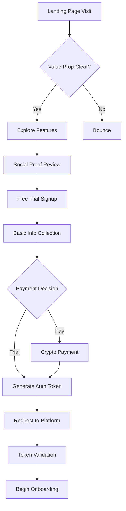
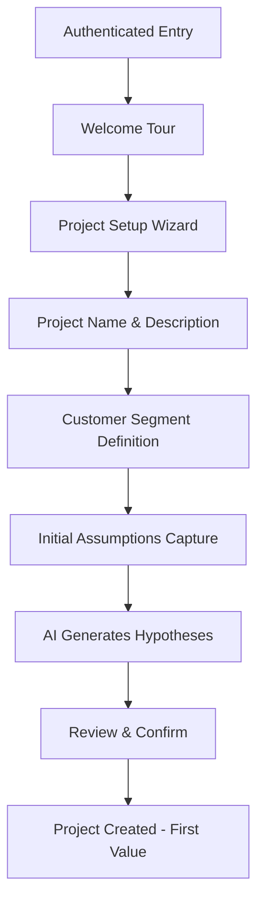
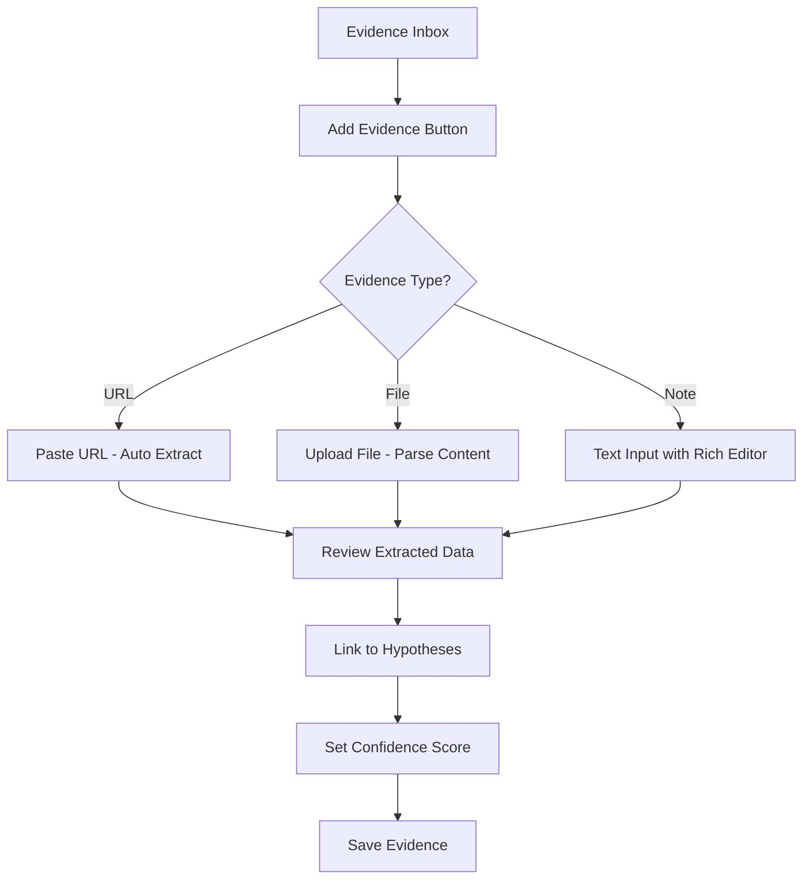
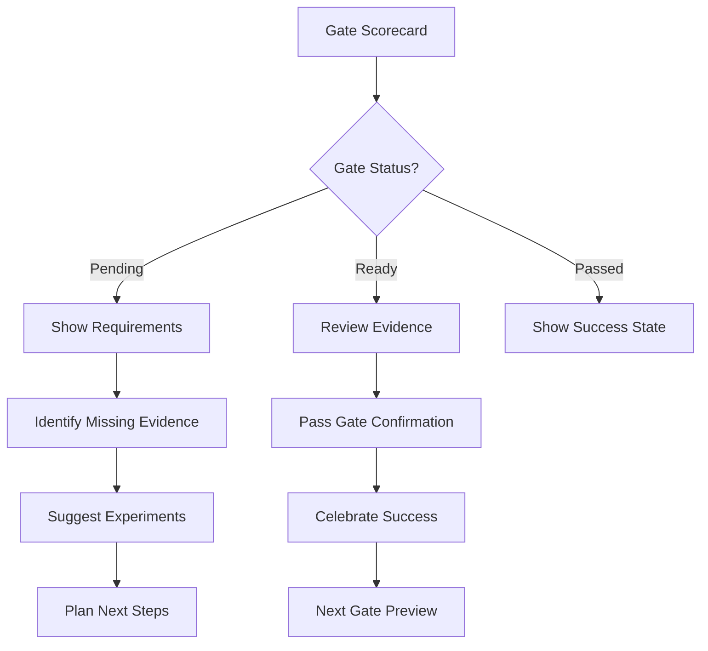

# 🎨 StartupAI User Experience Design

**Product:** Evidence-Led Strategy Platform  
**Version:** MVP 1.0  
**Date:** September 2025  

---

## Design Principles

### 1. Evidence-First
Every claim, recommendation, and insight must be traceable to supporting evidence or clearly marked as an assumption.

### 2. Progressive Disclosure
Complex functionality is revealed gradually as users become more sophisticated, preventing overwhelming new users.

### 3. Guided Discovery
The interface actively guides users through the validation process rather than just providing tools.

### 4. Trust Through Transparency
All AI-generated content shows confidence levels, sources, and limitations to build user trust.

### 5. Mobile-First Responsive
Core functionality works seamlessly across all device sizes.

---

## Cross-Site User Journey Map

### Complete User Journey: Prospect → Customer → Advocate

#### Phase 1: Discovery & Conversion (startupai.site) - 5-15 minutes
```
Landing Page Visit → Value Prop Engagement → Social Proof Review → 
Free Trial Signup → Payment Decision → Secure Handoff
```

**Key Moments:**
- **First Impression:** Clear value proposition and social proof
- **Trust Building:** Testimonials, case studies, and transparent pricing
- **Conversion Decision:** Free trial vs immediate payment choice
- **Seamless Transition:** Invisible handoff to product platform

**Success Metrics:**
- Landing page engagement >2 minutes
- Trial signup conversion >3%
- Payment completion >15% of trials
- Handoff success rate >99%

#### Phase 2: Onboarding & First Value (app.startupai.site) - 10-20 minutes
```
Secure Login → Welcome Tour → Project Creation → First Hypothesis → 
AI-Generated Insights → Aha Moment
```

**Key Moments:**
- **Seamless Entry:** Automatic authentication from marketing site
- **Guided Setup:** Structured project creation with smart defaults
- **First Value:** AI-generated business model canvas or validation roadmap
- **Engagement Hook:** Seeing personalized recommendations and next steps

**Success Metrics:**
- Time to first project <5 minutes
- First AI generation completion >90%
- User satisfaction with onboarding >4.5/5
- Feature discovery rate >70%

#### Phase 3: Daily Usage & Value Realization (5-30 minutes per session)
```
Dashboard → Active Project → Evidence Collection → Hypothesis Updates → 
AI Insights → Report Generation → Progress Sharing
```

**Key Flows:**
- Quick evidence capture from multiple sources
- Hypothesis validation and iteration
- AI-powered insight generation
- Professional report creation and sharing

**Success Metrics:**
- Daily active usage >3 sessions/week
- Evidence collection >5 items/project
- Report generation >2 reports/month
- User retention >70% at 30 days

#### Phase 4: Advocacy & Growth (ongoing)
```
Success Achievement → Results Sharing → Referral Generation → 
Case Study Participation → Community Engagement
```

**Key Moments:**
- **Results Validation:** External validation of AI-generated strategies
- **Success Sharing:** Social proof generation through results
- **Referral Behavior:** Organic word-of-mouth marketing
- **Community Building:** User-generated content and testimonials

**Success Metrics:**
- Net Promoter Score >50
- Referral rate >20% of active users
- Case study participation >10% of successful users
- Community engagement >30% of users

**📋 Related Documentation:**
- **Business Requirements:** [MVP Specification](../product/mvp-specification.md)
- **User Stories:** [User Stories - All Epics](../product/user-stories.md)
- **Technical Implementation:** [Two-Site Implementation Plan](../technical/two-site-implementation-plan.md)
- **System Architecture:** [High-Level Architecture Specification](../technical/high_level_architectural_spec.md)

---

## Two-Site Information Architecture

```
StartupAI Ecosystem

┌─ startupai.site (Marketing) ─────────────────┐
│  ├── Landing Page                           │
│  │   ├── Hero Section                       │
│  │   ├── Value Proposition                  │
│  │   ├── Social Proof                      │
│  │   └── Call-to-Action                    │
│  ├── Pricing & Plans                       │
│  ├── About & Team                          │
│  ├── Case Studies                          │
│  ├── Free Trial Signup                     │
│  ├── Payment Processing                     │
│  └── Secure Handoff                        │
└─────────────────────────────────────────────┘
                    ↓ JWT Token
┌─ app.startupai.site (Product) ────────────┐
│  ├── Authentication Receiver               │
│  ├── User Dashboard                        │
│  │   ├── Projects Overview                 │
│  │   ├── Recent Activity                   │
│  │   ├── Progress Tracking                 │
│  │   └── Quick Actions                     │
│  └── Project Workspace                     │
│      ├── Overview (Fit Dashboard)          │
│      ├── Hypothesis Hub                    │
│      ├── Evidence Inbox                    │
│      ├── Experiment Planner                │
│      ├── Gate Scorecard                    │
│      ├── AI Report Composer                │
│      └── Settings & Profile                │
└─────────────────────────────────────────────┘

Shared Services:
├── Supabase Authentication
├── User Profile Management
├── Payment & Subscription
├── Analytics & Tracking
└── Customer Support
```

---

## Key User Flows

### Flow 1: Cross-Site User Acquisition


**Design Requirements:**
- Landing page loads in <2 seconds
- Value proposition visible above fold
- Social proof prominently displayed
- Signup form minimal friction (email + name only)
- Payment options clearly explained
- Seamless handoff with loading states

### Flow 2: Project Creation (Post-Handoff)


**Design Requirements:**
- Automatic authentication from token
- Optional welcome tour for new users
- Single-page flow with progress indicator
- Smart defaults and AI suggestions
- Ability to go back and edit
- Clear celebration of first project creation

### Flow 3: Evidence Collection


**Design Requirements:**
- Multiple input methods clearly presented
- Auto-extraction feedback and editing
- Visual hypothesis linking interface
- Confidence scoring with explanations

### Flow 4: Gate Progression


**Design Requirements:**
- Clear visual status indicators
- Detailed requirement breakdowns
- Actionable next steps
- Progress celebration

---

## Component Library

### Core Components

**ProjectCard**
```typescript
interface ProjectCardProps {
  project: Project;
  onSelect: (id: string) => void;
  showProgress?: boolean;
}
```
- Visual progress indicators
- Quick action buttons
- Status badges

**HypothesisRow**
```typescript
interface HypothesisRowProps {
  hypothesis: Hypothesis;
  evidenceCount: number;
  onEdit: (id: string) => void;
  onLink: (id: string) => void;
}
```
- Risk level indicators
- Evidence count badges
- Quick action menu

**EvidenceCard**
```typescript
interface EvidenceCardProps {
  evidence: Evidence;
  linkedHypotheses: Hypothesis[];
  onLink: (evidenceId: string, hypothesisId: string) => void;
}
```
- Source type icons
- Confidence score display
- Linked hypothesis tags

**GateStatus**
```typescript
interface GateStatusProps {
  gate: Gate;
  requirements: Requirement[];
  onOverride?: () => void;
}
```
- Progress rings
- Requirement checklists
- Override controls

### Design System

**Colors**
```css
:root {
  --primary: #2563eb;      /* Blue - Trust, reliability */
  --secondary: #7c3aed;    /* Purple - Innovation, AI */
  --success: #059669;      /* Green - Validation, success */
  --warning: #d97706;      /* Orange - Caution, assumptions */
  --error: #dc2626;        /* Red - Risk, failure */
  --neutral: #6b7280;      /* Gray - Secondary text */
}
```

**Typography**
```css
.heading-xl { font-size: 2.25rem; font-weight: 800; }
.heading-lg { font-size: 1.875rem; font-weight: 700; }
.heading-md { font-size: 1.5rem; font-weight: 600; }
.body-lg { font-size: 1.125rem; line-height: 1.75; }
.body-md { font-size: 1rem; line-height: 1.5; }
.body-sm { font-size: 0.875rem; line-height: 1.25; }
```

**Spacing Scale**
```css
.space-xs { margin: 0.25rem; }    /* 4px */
.space-sm { margin: 0.5rem; }     /* 8px */
.space-md { margin: 1rem; }       /* 16px */
.space-lg { margin: 1.5rem; }     /* 24px */
.space-xl { margin: 2rem; }       /* 32px */
```

---

## Responsive Design

### Breakpoints
- **Mobile:** 320px - 768px
- **Tablet:** 768px - 1024px  
- **Desktop:** 1024px+

### Mobile-First Approach

**Navigation**
- Collapsible sidebar on mobile
- Bottom tab bar for core actions
- Swipe gestures for common tasks

**Data Tables**
- Card layout on mobile
- Horizontal scroll on tablet
- Full table on desktop

**Forms**
- Single column on mobile
- Two column on tablet+
- Progressive enhancement

---

## Accessibility Standards

**📋 Comprehensive Documentation:** [Accessibility Standards & Guidelines](accessibility-standards.md)

StartupAI follows **WCAG 2.0, 2.1, and 2.2 AA compliance** with special attention to AI accessibility integration.

### WCAG 2.0/2.1/2.2 AA Compliance

#### Core Requirements
- **Color Contrast:** 4.5:1 minimum for normal text, 3:1 for large text and UI components
- **Keyboard Navigation:** All functionality accessible via keyboard, including AI interactions
- **Screen Readers:** Proper ARIA labels, semantic HTML, and AI content announcements
- **Focus Management:** Clear focus indicators (minimum 2px outline) and logical tab order
- **Responsive Design:** Content reflows to 320px width without horizontal scrolling
- **Text Spacing:** Interface adapts to increased line height (1.5x) and paragraph spacing (2x)

#### WCAG 2.1 Enhancements
- **Orientation Support:** AI dashboards work in both portrait and landscape
- **Input Purpose:** Form fields have programmatically determinable purpose
- **Motion Alternatives:** AI gesture controls have keyboard/pointer alternatives
- **Status Messages:** AI processing states announced to assistive technologies

#### WCAG 2.2 Latest Standards
- **Focus Visibility:** Enhanced focus indicators (minimum 24×24px targets)
- **Consistent Help:** AI assistance features in consistent locations
- **Accessible Authentication:** AI-powered auth provides cognitive alternatives
- **Redundant Entry:** AI remembers user inputs to reduce re-entry

### AI-Specific Accessibility

#### CrewAI Integration
- **Agent Communication:** AI responses include reading level analysis and structure
- **Processing Transparency:** Clear progress indicators with pause/cancel options
- **Multi-Modal Output:** Text descriptions for all AI-generated visualizations
- **Error Recovery:** Plain language error messages with actionable suggestions

#### OpenAI & Vercel AI SDK
- **Accessible Prompting:** AI generates content at 8th-grade reading level
- **Stream Announcements:** Real-time AI responses announced to screen readers
- **Model Switching:** Consistent accessibility across all AI models
- **Bias Mitigation:** AI outputs reviewed for inclusive language and examples

### Implementation Examples

#### Accessible AI Form
```typescript
export function AccessibleAIForm() {
  const [isProcessing, setIsProcessing] = useState(false);
  const [progress, setProgress] = useState(0);
  
  return (
    <form role="form" aria-labelledby="ai-form-title">
      <h2 id="ai-form-title">Business Hypothesis Analysis</h2>
      
      <div className="form-group">
        <label htmlFor="hypothesis" className="required">
          Hypothesis Statement
          <span className="sr-only">(required)</span>
        </label>
        <textarea
          id="hypothesis"
          aria-describedby="hypothesis-help hypothesis-error"
          aria-required="true"
          className="min-h-24 resize-y"
        />
        <div id="hypothesis-help" className="help-text">
          Describe what you believe to be true about your customers or market
        </div>
      </div>
      
      <button 
        type="submit" 
        disabled={isProcessing}
        aria-describedby="ai-status"
      >
        {isProcessing ? 'Analyzing...' : 'Generate AI Insights'}
      </button>
      
      {isProcessing && (
        <div 
          id="ai-status" 
          role="status" 
          aria-live="polite"
          className="mt-4"
        >
          <div 
            role="progressbar"
            aria-valuenow={progress}
            aria-valuemin={0}
            aria-valuemax={100}
            aria-label="AI analysis progress"
          >
            AI processing: {progress}% complete
          </div>
        </div>
      )}
    </form>
  );
}
```

#### Accessible Data Visualization
```typescript
export function AccessibleHypothesisTable({ hypotheses }: Props) {
  return (
    <div className="overflow-x-auto">
      <table role="table" aria-label="Project hypotheses analysis">
        <caption className="sr-only">
          Table showing {hypotheses.length} hypotheses with risk levels and evidence counts
        </caption>
        <thead>
          <tr>
            <th scope="col" className="text-left">Hypothesis</th>
            <th scope="col" className="text-center">Risk Level</th>
            <th scope="col" className="text-center">Evidence Count</th>
            <th scope="col" className="text-center">
              <span className="sr-only">Actions</span>
              <span aria-hidden="true">Actions</span>
            </th>
          </tr>
        </thead>
        <tbody>
          {hypotheses.map((hypothesis, index) => (
            <tr key={hypothesis.id}>
              <td>
                <div className="font-medium">{hypothesis.statement}</div>
                {hypothesis.aiGenerated && (
                  <span className="text-sm text-gray-500" role="note">
                    <span className="sr-only">AI Generated: </span>
                    Generated by AI analysis
                  </span>
                )}
              </td>
              <td className="text-center">
                <Badge 
                  variant={hypothesis.riskLevel}
                  aria-label={`Risk level: ${hypothesis.riskLevel}`}
                  className="min-w-16 justify-center"
                >
                  {hypothesis.riskLevel}
                </Badge>
              </td>
              <td className="text-center">
                <span aria-label={`${hypothesis.evidenceCount} pieces of evidence`}>
                  {hypothesis.evidenceCount}
                </span>
              </td>
              <td className="text-center">
                <button
                  aria-label={`Edit hypothesis: ${hypothesis.statement.substring(0, 50)}...`}
                  className="btn-sm btn-outline"
                >
                  Edit
                </button>
              </td>
            </tr>
          ))}
        </tbody>
      </table>
    </div>
  );
}
```

---

## Performance Considerations

### Loading States
- Skeleton screens for content loading
- Progressive image loading
- Optimistic updates for user actions

### Data Management
- Virtual scrolling for large lists
- Pagination for evidence and experiments
- Caching for frequently accessed data

### AI Response Handling
```typescript
// Loading state management
export function useAIGeneration() {
  const [loading, setLoading] = useState(false);
  const [progress, setProgress] = useState(0);
  
  const generate = async (prompt: string) => {
    setLoading(true);
    setProgress(0);
    
    // Simulate progress updates
    const interval = setInterval(() => {
      setProgress(prev => Math.min(prev + 10, 90));
    }, 200);
    
    try {
      const result = await aiService.generate(prompt);
      setProgress(100);
      return result;
    } finally {
      clearInterval(interval);
      setLoading(false);
      setProgress(0);
    }
  };
  
  return { generate, loading, progress };
}
```

---

## Error Handling & Edge Cases

### Error States
- **Network Errors:** Retry mechanisms with exponential backoff
- **AI Failures:** Graceful degradation with manual input options
- **Validation Errors:** Inline error messages with correction guidance
- **Permission Errors:** Clear messaging about access requirements

### Empty States
- **New Project:** Guided setup with templates and examples
- **No Evidence:** Clear call-to-action with input suggestions
- **No Experiments:** Template library and recommendations
- **Failed Gates:** Specific guidance on requirements

### Data Validation
```typescript
// Form validation with user-friendly errors
export function validateHypothesis(hypothesis: Partial<Hypothesis>) {
  const errors: ValidationError[] = [];
  
  if (!hypothesis.statement?.trim()) {
    errors.push({
      field: 'statement',
      message: 'Please describe what you believe to be true',
      suggestion: 'Try: "Customers will pay $X for feature Y"'
    });
  }
  
  if (!hypothesis.category) {
    errors.push({
      field: 'category',
      message: 'Please categorize this hypothesis',
      suggestion: 'Choose: Desirability, Feasibility, or Viability'
    });
  }
  
  return errors;
}
```

---

This UX design specification ensures StartupAI provides an intuitive, accessible, and engaging experience that guides users through evidence-based business validation while maintaining trust and transparency.
